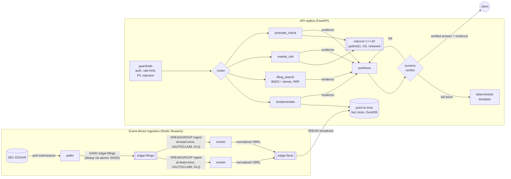
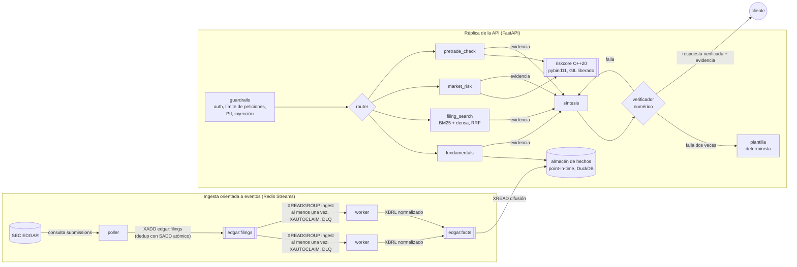

# Filings & Risk Copilot

[](https://github.com/apayne185/merchant-intelligence-hub/actions/workflows/ci.yml)

**English** | [Español](#versión-en-español)

A multi-agent research copilot for SEC filings and portfolio risk that **never states a number it cannot trace to a source**. Ask about a company's fundamentals, what its 10-K says about a risk, or how risky a portfolio is; every figure in the answer is checked against the exact XBRL fact, filing passage or risk computation that produced it, and an answer that fails the check never reaches the caller.

Built by Anna Payne.

---

## Why this exists

LLMs are useful for reading filings and explaining risk, and dangerous for the same job: a fluent answer with one wrong digit is worse than no answer in front of a portfolio manager. Three failure modes this project is designed around:

| Failure mode | What usually happens | What this system does |
|---|---|---|
| **Hallucinated figures** | "Revenue was $461.2B" (it was $416.16B) reads fine | Every number in the answer is parsed and matched to evidence at its stated precision; unmatched numbers trigger a regeneration, then a deterministic fallback |
| **Look-ahead bias** | Backtests and "what did we know then" questions silently use restated or later-filed numbers | A point-in-time fact store keeps every filed version; `as_of` sees only what was filed by that date |
| **Uncalibrated risk numbers** | A VaR figure with no evidence it is right | Every VaR ships with a rolling backtest and a Kupiec test, plus Euler attribution of which position drives it |

## What it does

Four specialist agents behind a LangGraph orchestrator:

| Agent | Answers | Backed by |
|---|---|---|
| `fundamentals` | Revenue, income, margins, EPS, leverage, free cash flow, growth, implied Q4 | Point-in-time XBRL fact store (DuckDB), 7.5k fact versions from real SEC filings |
| `filing_search` | "What does NVIDIA's 10-K say about export controls?" | Hybrid BM25 + dense retrieval (Reciprocal Rank Fusion) over 833 Item 1A passages |
| `market_risk` | VaR / Expected Shortfall, risk attribution, model backtest | **C++20 engine (`riskcore`) via pybind11**: historical, parametric and 10-day Student-t Monte Carlo |
| `pretrade_check` | "Can I put 50% in Tesla?" | Deterministic limit rules (single name, sector, gross, VaR). The LLM can explain a verdict, never change it. No orders are sent. |

New filings arrive through an **event-driven ingestion pipeline on Redis Streams**: a poller detects new 10-K/10-Q filings on EDGAR, a consumer group of workers normalizes their XBRL, and every API replica applies the update to its in-memory fact store.

## Example

```bash
curl -s localhost:8001/ask -H 'content-type: application/json' \
  -d '{"question": "What was Apple'\''s net margin in FY2025, and what does its 10-K say about supply chain concentration?"}'
```

```jsonc
{
  "route": ["fundamentals", "filing_search"],
  "answer": "Apple (AAPL) net margin for FY 2025 was 26.9% (net_income / revenue) [AAPL:net_margin:FY2025]. AAPL's 10-K filed 2025-10-31 (Item 1A. Risk Factors) states: \"...the Company's global supply chain is large and complex and a majority of the Company's supplier facilities ... are located outside the U.S.\" [AAPL:0000320193-25-000079:1A:001:8a348a65] ...",
  "verification": { "status": "verified", "numbers_checked": 1, "numbers_verified": 1, "fallback_used": false },
  "evidence": [
    { "id": "AAPL:net_margin:FY2025", "kind": "derived_metric", "values": { "value": 0.26915 },
      "source": { "formula": "net_income / revenue",
                  "inputs": ["AAPL:net_income:FY2025:0000320193-25-000079", "AAPL:revenue:FY2025:0000320193-25-000079"] } },
    { "id": "AAPL:net_income:FY2025:0000320193-25-000079", "kind": "xbrl_fact", "values": { "value": 112010000000 },
      "source": { "concept": "us-gaap:NetIncomeLoss", "form": "10-K", "filed": "2025-10-31",
                  "url": "https://www.sec.gov/Archives/edgar/data/320193/000032019325000079/" } }
  ],
  "latency_ms": 57,
  "trace": [{ "node": "route", "duration_ms": 2.2 }, { "node": "fundamentals", "duration_ms": 18.3 }, "..."]
}
```

Point in time: the same question with `"as_of": "2020-06-01"` about FY2019 EPS returns **$11.89** (as filed); without it, **$2.97** (restated after the 2020 4:1 split).

## Architecture



## Measured results

All numbers below are reproducible from this repository (`make eval`, `make bench`, `make test`).

**Golden-set evaluation** (`outputs/eval_report.json`, 37 cases, run in CI as a hard gate). Expected figures are taken straight from SEC companyfacts by concept and period end date, not from the code under test.

| Metric | Result |
|---|---|
| Route accuracy | 100% |
| Figure accuracy (right SEC number, stated in the answer) | 100% |
| Numeric hallucination rate (93 numbers checked) | 0% |
| Retrieval hit rate (right company, relevant passage) | 100% |
| Pre-trade decision accuracy | 100% |
| Unanswerable questions answered honestly ("not reported") | 100% |
| **Verifier recall on 442 corrupted answers** (each number perturbed by -10% to +50%, or digits transposed) | **100%** |
| Verifier false-positive rate on correct answers | 0% |
| `/ask` latency, mock LLM (p50 / p95) | 20 ms / 34 ms |

These are mock-LLM numbers, which test the pipeline and the verifier deterministically. `python -m scripts.evaluate_copilot --real` runs the same set against a real model and additionally records time to first token, tokens and cost per answer (exported as Prometheus metrics).

**C++ engine vs vectorized NumPy** (`outputs/benchmark_riskcore.json`; Intel i7-1065G7, 4 cores / 8 threads, a thermally limited laptop, so ranges across runs):

| Workload | Speedup | How |
|---|---:|---|
| Historical VaR/ES, 1M scenarios | 2-3x | Sample-then-filter selection instead of a full partition; zero-copy NumPy view |
| Rolling VaR backtest, 10 years daily | ~8x | Sliding sorted window (binary-search insert/erase) instead of re-selecting each day |
| 10-day Student-t Monte Carlo, 10 assets, 100k paths, 1 thread | ~1.2x | About parity: NumPy's batched matmul is already C |
| Same, 8 threads | 7-8x | Fixed-size path blocks with counter-seeded RNG streams; GIL released |

The first version of the engine was *slower* than NumPy on two of these (libstdc++'s `nth_element` loses to NumPy's introselect, and the bindings copied every input twice); the profile and the fixes are in [DECISIONS.md](DECISIONS.md#d7).

**Quality gates**: 184 Python tests (94% branch coverage, gate at 85%), 60 C++ checks run under AddressSanitizer + UndefinedBehaviorSanitizer, mypy strict on the data, risk, streaming and verification packages, Bandit with zero findings, Trivy with zero fixable HIGH/CRITICAL, and a container smoke test under Kubernetes runtime constraints (read-only root filesystem, non-root, no capabilities).

## Quickstart

Requires [uv](https://docs.astral.sh/uv/) and a C++20 compiler (g++ 10+ or clang 13+); `uv sync` compiles the engine.

```bash
uv sync --extra dev
make run                     # API on :8001, MOCK_LLM=1 (offline, zero cost)
make test && make eval       # tests, then the golden-set eval and its CI floors
make bench                   # C++ vs NumPy benchmark
make cpp-test                # C++ unit tests, release + ASan/UBSan
```

Full stack (API, two ingest workers, Redis, Postgres, OpenTelemetry Collector, Jaeger, Prometheus, Grafana):

```bash
make up
make replay                  # publish the committed filing index into the ingest stream
TOKEN=$(make token)
curl -s localhost:8001/ask -H "Authorization: Bearer $TOKEN" -H 'content-type: application/json' \
  -d '{"question": "What is the 99% VaR of 40% NVDA, 30% AAPL and 30% XOM?"}'
```

Real LLM: put `OPENAI_API_KEY` (or Azure OpenAI settings) in `.env` and set `MOCK_LLM=0`. Live EDGAR polling: `SEC_USER_AGENT="Your Name you@example.com" docker compose --profile live up -d poller` (SEC requires a contact User-Agent).

## API

| Endpoint | Purpose |
|---|---|
| `POST /ask` | Question, optional `tickers`, `as_of` (point in time) and `portfolio` -> verified, cited answer with evidence |
| `GET /v1/facts/{ticker}?fiscal_year=&as_of=` | Reported and derived fundamentals with provenance (no LLM) |
| `GET /v1/facts/{ticker}/{metric}/versions?fiscal_year=` | Every filed version of one figure (restatement audit) |
| `POST /v1/risk` | Portfolio VaR / ES / backtest / attribution from the C++ engine (no LLM) |
| `GET /health`, `/ready`, `/metrics` | Liveness, readiness (fails on an empty fact store), Prometheus |

The `/v1` endpoints are the deterministic path for systems that want the numbers without a language model in the loop. All endpoints except health and metrics require a Bearer JWT in production (RS256 via the identity provider's JWKS).

## Repository layout

```
cpp/riskcore/          C++20 VaR/ES engine, pybind11 bindings, CMake, C++ unit tests
src/filings/           EDGAR client (rate limited), XBRL normalizer, 10-K section extraction, point-in-time fact store
src/marketdata/        Daily adjusted prices and return construction
src/risk/              Engine facade (VaR, backtest, attribution) and the NumPy reference implementation
src/copilot/           FastAPI app, LangGraph graph, router, tools, synthesis, numeric verifier, retrieval
src/copilot/infra/     Auth, rate limiting, cache, audit log, guardrails, metrics, structured logging
src/streaming/         Redis Streams poller, ingest worker (consumer group), fact subscriber
scripts/               Eval harness and CI floors, benchmark, fixture refresh, style check, dev tokens
data/                  Real SEC XBRL facts, 10-K risk-factor passages, prices, golden set, risk limits
deploy/ k8s/ terraform/  Observability config, Kubernetes (Kustomize), AWS ECS (Terraform)
```

## Engineering practices

- **CI/CD** (GitHub Actions): lint, mypy, Bandit, Trivy, C++ build + sanitizers, tests with coverage gate, eval floors, integration tests against real Redis and Postgres, manifest validation (kubeconform, promtool, otelcol), container smoke test and image scan; on `main`, the image is published to GHCR with an SBOM and SLSA provenance and signed with cosign (keyless).
- **Supply chain**: every action pinned to a commit SHA, scanners run as digest-pinned images, base images pinned by digest, Dependabot for Python, Actions, Docker and Compose.
- **Observability**: Prometheus metrics (per-node latency, verification outcomes, LLM time to first token, tokens and cost, ingest lag, fact-store version per replica), OpenTelemetry traces through the collector to Jaeger, JSON logs correlated by request and trace id, alert rules including replica divergence and dead-lettered filings.
- **Decisions are written down**: [DECISIONS.md](DECISIONS.md) records 22 design decisions with what was done, why, what was rejected and what was assumed, including the bugs that testing found.

## Data and licensing

- SEC EDGAR data (XBRL company facts, filings) is public. Fixtures are refreshed with `make fixtures`, which honours SEC's fair-access policy (declared User-Agent, at most 10 requests per second).
- Daily prices in `data/prices/` come from a public chart endpoint and are for demonstration only; `src/marketdata/prices.py` isolates the provider behind one function so a licensed feed replaces it without touching the risk code.
- Covered universe: AAPL, MSFT, NVDA, AMZN, JPM, GS, XOM, JNJ, TSLA, KO (10-K/10-Q facts from FY2019).

## Limitations and next steps

- **Universe and history are small by design** (10 issuers, 5 years of prices); the fact store and ingestion pipeline have no structural limit, the fixture size is a repository-size choice.
- **Dates and named entities in answers are not verified**, only quantities. Verifying dates against filing metadata is the natural next check.
- **Mock mode measures the pipeline, not the model.** The real-model eval exists but needs an API key to run; its numbers are not committed.
- **Risk model scope**: linear equity positions, i.i.d. daily shocks. No options, no volatility clustering (GARCH / filtered historical simulation would be next), no intraday data.
- **No order routing** on purpose. `pretrade_check` returns a decision record for an execution system or a human.

---

# Versión en español

**[English](#filings--risk-copilot)** | Español

Un copiloto de investigación multiagente sobre informes de la SEC y riesgo de cartera que **nunca afirma una cifra que no pueda rastrear hasta su fuente**. Pregunta por los fundamentales de una empresa, por lo que dice su 10-K sobre un riesgo o por el riesgo de una cartera; cada cifra de la respuesta se contrasta con el dato XBRL exacto, el pasaje del informe o el cálculo de riesgo que la produjo, y una respuesta que no supera la comprobación nunca llega al cliente.

Desarrollado por Anna Payne.

## Por qué existe

Los LLM son útiles para leer informes y explicar el riesgo, y peligrosos para esa misma tarea: una respuesta fluida con un dígito equivocado es peor que ninguna respuesta delante de un gestor de carteras. El proyecto está diseñado en torno a tres modos de fallo:

| Modo de fallo | Lo que suele pasar | Lo que hace este sistema |
|---|---|---|
| **Cifras alucinadas** | "Los ingresos fueron 461.200 M$" (fueron 416.160 M$) y se lee bien | Cada número de la respuesta se extrae y se compara con la evidencia a la precisión con la que está escrito; si no coincide, se regenera la respuesta y, si vuelve a fallar, se usa una plantilla determinista |
| **Sesgo de anticipación** (look-ahead) | Los backtests y las preguntas de "qué sabíamos entonces" usan sin avisar cifras reexpresadas o publicadas después | Un almacén de hechos *point-in-time* guarda cada versión presentada; `as_of` solo ve lo presentado hasta esa fecha |
| **Cifras de riesgo sin calibrar** | Un VaR sin ninguna prueba de que sea correcto | Cada VaR va acompañado de un backtest móvil y del test de Kupiec, y de la atribución de Euler de qué posición lo genera |

## Qué hace

Cuatro agentes especialistas detrás de un orquestador LangGraph:

| Agente | Responde | Respaldado por |
|---|---|---|
| `fundamentals` | Ingresos, beneficio, márgenes, BPA, apalancamiento, flujo de caja libre, crecimiento, cuarto trimestre implícito | Almacén de hechos XBRL *point-in-time* (DuckDB), 7.500 versiones de hechos de informes reales de la SEC |
| `filing_search` | "¿Qué dice el 10-K de NVIDIA sobre controles de exportación?" | Recuperación híbrida BM25 + densa (Reciprocal Rank Fusion) sobre 833 pasajes del Item 1A |
| `market_risk` | VaR / Expected Shortfall, atribución de riesgo, backtest del modelo | **Motor C++20 (`riskcore`) vía pybind11**: histórico, paramétrico y Monte Carlo a 10 días con t de Student |
| `pretrade_check` | "¿Puedo poner el 50% en Tesla?" | Reglas de límites deterministas (emisor, sector, exposición bruta, VaR). El LLM puede explicar el veredicto, nunca cambiarlo. No se envían órdenes. |

Los informes nuevos llegan por un **pipeline de ingesta orientado a eventos sobre Redis Streams**: un *poller* detecta nuevos 10-K/10-Q en EDGAR, un grupo de consumidores normaliza su XBRL y cada réplica de la API aplica la actualización a su almacén de hechos en memoria.

## Ejemplo

```bash
curl -s localhost:8001/ask -H 'content-type: application/json' \
  -d '{"question": "What was Apple'\''s net margin in FY2025, and what does its 10-K say about supply chain concentration?", "locale": "es"}'
```

```jsonc
{
  "route": ["fundamentals", "filing_search"],
  "answer": "Apple (AAPL) net margin for FY 2025 was 26.9% (net_income / revenue) [AAPL:net_margin:FY2025]. ...",
  "verification": { "status": "verified", "numbers_checked": 1, "numbers_verified": 1, "fallback_used": false },
  "evidence": [
    { "id": "AAPL:net_margin:FY2025", "kind": "derived_metric", "values": { "value": 0.26915 },
      "source": { "formula": "net_income / revenue",
                  "inputs": ["AAPL:net_income:FY2025:0000320193-25-000079", "AAPL:revenue:FY2025:0000320193-25-000079"] } },
    { "id": "AAPL:net_income:FY2025:0000320193-25-000079", "kind": "xbrl_fact", "values": { "value": 112010000000 },
      "source": { "concept": "us-gaap:NetIncomeLoss", "form": "10-K", "filed": "2025-10-31",
                  "url": "https://www.sec.gov/Archives/edgar/data/320193/000032019325000079/" } }
  ]
}
```

La respuesta cita cada dato con su identificador; la evidencia incluye el hecho XBRL con su número de registro, fecha de presentación y URL en la SEC, y el margen con su fórmula y sus entradas. Con `"locale": "es"` y un LLM real, la respuesta se redacta en español (el modo simulado responde con la plantilla en inglés).

*Point in time*: la misma pregunta con `"as_of": "2020-06-01"` sobre el BPA de FY2019 devuelve **11,89 $** (tal como se presentó); sin él, **2,97 $** (reexpresado tras el *split* 4:1 de 2020).

## Arquitectura



## Resultados medidos

Todo es reproducible desde el repositorio (`make eval`, `make bench`, `make test`).

**Evaluación con golden set** (`outputs/eval_report.json`, 37 casos, umbral obligatorio en CI). Las cifras esperadas se toman directamente de *companyfacts* de la SEC por concepto y fecha de cierre del periodo, no del código que se está probando.

| Métrica | Resultado |
|---|---|
| Precisión del enrutado | 100% |
| Precisión de cifras (número correcto de la SEC, presente en la respuesta) | 100% |
| Tasa de cifras alucinadas (93 números comprobados) | 0% |
| Tasa de acierto de la recuperación | 100% |
| Precisión de la decisión pre-trade | 100% |
| Preguntas sin respuesta contestadas con honestidad ("no se reporta") | 100% |
| **Recall del verificador sobre 442 respuestas corrompidas** (cada número alterado entre -10% y +50%, o con dígitos transpuestos) | **100%** |
| Falsos positivos del verificador sobre respuestas correctas | 0% |
| Latencia de `/ask` con LLM simulado (p50 / p95) | 20 ms / 34 ms |

Son cifras con LLM simulado, que prueban el pipeline y el verificador de forma determinista. `python -m scripts.evaluate_copilot --real` ejecuta el mismo conjunto contra un modelo real y registra además el tiempo hasta el primer token, los tokens y el coste por respuesta (exportados como métricas de Prometheus).

**Motor C++ frente a NumPy vectorizado** (`outputs/benchmark_riskcore.json`; Intel i7-1065G7, 4 núcleos / 8 hilos, un portátil con limitación térmica, de ahí los rangos):

| Carga | Mejora | Cómo |
|---|---:|---|
| VaR/ES histórico, 1 M de escenarios | 2-3x | Selección por muestreo y filtrado en lugar de una partición completa; vista sin copia del array de NumPy |
| Backtest móvil del VaR, 10 años diarios | ~8x | Ventana ordenada deslizante (inserción y borrado por búsqueda binaria) en lugar de volver a seleccionar cada día |
| Monte Carlo t de Student a 10 días, 10 activos, 100k trayectorias, 1 hilo | ~1,2x | Prácticamente igual: la multiplicación matricial por lotes de NumPy ya es C |
| Igual, 8 hilos | 7-8x | Bloques de trayectorias de tamaño fijo con generadores sembrados por contador; GIL liberado |

La primera versión del motor era *más lenta* que NumPy en dos de estas cargas (el `nth_element` de libstdc++ pierde frente al *introselect* de NumPy y los *bindings* copiaban cada entrada dos veces); el perfilado y las correcciones están en [DECISIONS.md](DECISIONS.md#d7).

**Controles de calidad**: 184 tests de Python (94% de cobertura de ramas, mínimo 85%), 60 comprobaciones de C++ ejecutadas con AddressSanitizer + UndefinedBehaviorSanitizer, mypy estricto en los paquetes de datos, riesgo, *streaming* y verificación, Bandit sin hallazgos, Trivy sin vulnerabilidades HIGH/CRITICAL corregibles y una prueba de humo del contenedor con las restricciones de Kubernetes (sistema de ficheros de solo lectura, usuario no root, sin *capabilities*).

## Inicio rápido

Requiere [uv](https://docs.astral.sh/uv/) y un compilador C++20 (g++ 10+ o clang 13+); `uv sync` compila el motor.

```bash
uv sync --extra dev
make run                     # API en :8001, MOCK_LLM=1 (sin red, coste cero)
make test && make eval       # tests, y después la evaluación con sus umbrales de CI
make bench                   # benchmark C++ frente a NumPy
make cpp-test                # tests de C++, release + ASan/UBSan
```

Pila completa (API, dos *workers* de ingesta, Redis, Postgres, OpenTelemetry Collector, Jaeger, Prometheus, Grafana):

```bash
make up
make replay                  # publica el índice de informes del repositorio en el stream de ingesta
TOKEN=$(make token)
curl -s localhost:8001/ask -H "Authorization: Bearer $TOKEN" -H 'content-type: application/json' \
  -d '{"question": "What is the 99% VaR of 40% NVDA, 30% AAPL and 30% XOM?"}'
```

LLM real: pon `OPENAI_API_KEY` (o la configuración de Azure OpenAI) en `.env` y `MOCK_LLM=0`. *Polling* en vivo de EDGAR: `SEC_USER_AGENT="Tu Nombre tu@ejemplo.com" docker compose --profile live up -d poller` (la SEC exige un User-Agent con contacto).

## API

| Endpoint | Función |
|---|---|
| `POST /ask` | Pregunta, con `tickers`, `as_of` (fecha de referencia) y `portfolio` opcionales -> respuesta verificada y citada, con su evidencia |
| `GET /v1/facts/{ticker}?fiscal_year=&as_of=` | Fundamentales reportados y derivados con su procedencia (sin LLM) |
| `GET /v1/facts/{ticker}/{metric}/versions?fiscal_year=` | Todas las versiones presentadas de una cifra (auditoría de reexpresiones) |
| `POST /v1/risk` | VaR / ES / backtest / atribución de una cartera desde el motor C++ (sin LLM) |
| `GET /health`, `/ready`, `/metrics` | *Liveness*, *readiness* (falla si el almacén de hechos está vacío), Prometheus |

Los endpoints `/v1` son el camino determinista para sistemas que quieren las cifras sin un modelo de lenguaje de por medio. En producción todos, salvo salud y métricas, exigen un JWT Bearer (RS256 vía el JWKS del proveedor de identidad).

## Estructura del repositorio

```
cpp/riskcore/          Motor VaR/ES en C++20, bindings pybind11, CMake, tests de C++
src/filings/           Cliente EDGAR (con límite de peticiones), normalizador XBRL, extracción de secciones del 10-K, almacén point-in-time
src/marketdata/        Precios diarios ajustados y construcción de rentabilidades
src/risk/              Fachada del motor (VaR, backtest, atribución) e implementación de referencia en NumPy
src/copilot/           App FastAPI, grafo LangGraph, router, herramientas, síntesis, verificador numérico, recuperación
src/copilot/infra/     Autenticación, límite de peticiones, caché, log de auditoría, guardrails, métricas, logging estructurado
src/streaming/         Poller de Redis Streams, worker de ingesta (grupo de consumidores), suscriptor de hechos
scripts/               Evaluación y umbrales de CI, benchmark, actualización de fixtures, control de estilo, tokens de desarrollo
data/                  Hechos XBRL reales de la SEC, pasajes de riesgos del 10-K, precios, golden set, límites de riesgo
deploy/ k8s/ terraform/  Configuración de observabilidad, Kubernetes (Kustomize), AWS ECS (Terraform)
```

## Prácticas de ingeniería

- **CI/CD** (GitHub Actions): lint, mypy, Bandit, Trivy, compilación de C++ con *sanitizers*, tests con umbral de cobertura, umbrales de evaluación, tests de integración contra Redis y Postgres reales, validación de manifiestos (kubeconform, promtool, otelcol), prueba de humo y escaneo de la imagen; en `main` la imagen se publica en GHCR con SBOM y procedencia SLSA y se firma con cosign (*keyless*).
- **Cadena de suministro**: cada *action* fijada a un SHA de commit, los escáneres se ejecutan como imágenes fijadas por *digest*, imágenes base fijadas por *digest*, Dependabot para Python, Actions, Docker y Compose.
- **Observabilidad**: métricas de Prometheus (latencia por nodo, resultados de verificación, tiempo hasta el primer token, tokens y coste, retraso de ingesta, versión del almacén de hechos por réplica), trazas OpenTelemetry hacia Jaeger, logs JSON correlacionados por id de petición y de traza, y reglas de alerta, incluidas la divergencia entre réplicas y los informes enviados a la cola de fallidos.
- **Las decisiones están escritas**: [DECISIONS.md](DECISIONS.md) recoge 22 decisiones de diseño con qué se hizo, por qué, qué se descartó y qué se supuso, incluidos los errores que encontraron los tests.

## Datos y licencias

- Los datos de SEC EDGAR (hechos XBRL, informes) son públicos. Los *fixtures* se actualizan con `make fixtures`, que respeta la política de acceso de la SEC (User-Agent declarado, como máximo 10 peticiones por segundo).
- Los precios diarios de `data/prices/` provienen de un endpoint público de gráficos y son solo para demostración; `src/marketdata/prices.py` aísla el proveedor en una función, de modo que un proveedor con licencia lo sustituye sin tocar el código de riesgo.
- Universo cubierto: AAPL, MSFT, NVDA, AMZN, JPM, GS, XOM, JNJ, TSLA, KO (hechos de 10-K/10-Q desde FY2019).

## Limitaciones y próximos pasos

- **El universo y el histórico son pequeños a propósito** (10 emisores, 5 años de precios); el almacén y la ingesta no tienen un límite estructural, el tamaño de los *fixtures* es una decisión de tamaño del repositorio.
- **Las fechas y las entidades de las respuestas no se verifican**, solo las cantidades. Verificar fechas contra los metadatos del informe es la siguiente comprobación natural.
- **El modo simulado mide el pipeline, no el modelo.** La evaluación con un modelo real existe, pero necesita una clave de API; sus resultados no están en el repositorio.
- **Alcance del modelo de riesgo**: posiciones lineales en acciones y *shocks* diarios i.i.d. Sin opciones, sin agrupamiento de volatilidad (GARCH o simulación histórica filtrada serían lo siguiente) y sin datos intradía.
- **Sin enrutado de órdenes**, a propósito. `pretrade_check` devuelve un registro de decisión para un sistema de ejecución o una persona.
